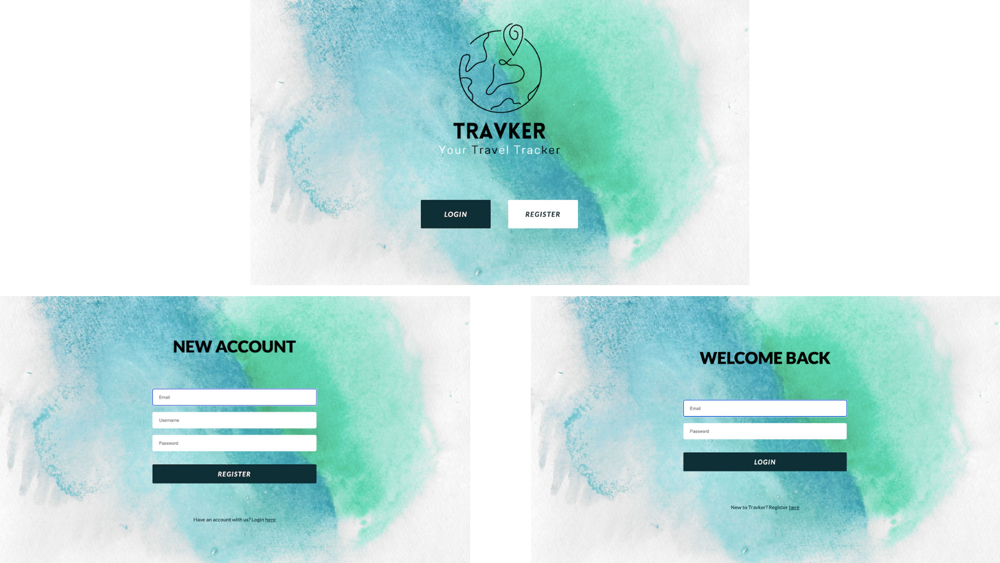
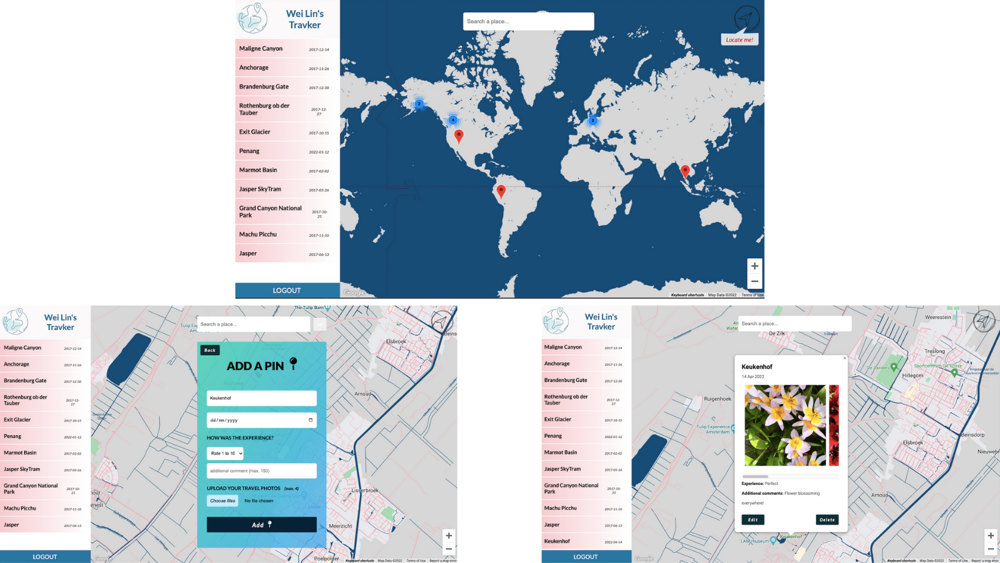

# Travker

<p align="center">
  
</p>
Travker is your personal digital world map where you can pin-point all the places you've travelled to.

1. Leveraging the power of Google Map api, for any place you find there, you can find it on TravKer too!
2. You are not only dropping a pin on Map, but also logging your travel details such as Date, Pictures (max. 4), Ratings and Comments so that you can always click on the pin and review your travel moments.
3. You can add as many pins as you like, edit and delete the pin as you wish.
4. All the pins are added automatically to the list of the sidebar on the left. You will be redirected to the pin location by just clicking any place.
5. A "Locate-me" icon on top right of the map is there for you to locate your current location.

## Table of contents

- [Overview](#overview)
  - [Screenshot](#screenshot)
  - [Links](#links)
- [Getting Started](#getting-started)
- [My Process](#my-process)
  - [Built with](#built-with)
  - [Continued development](#continued-development)
  - [Useful resources](#useful-resources)
- [Author](#author)
- [Acknowledgments](#acknowledgments)

## Overview

### Screenshot

#### Screenshot 1



#### Screenshot 1



- Homepage: [./screenshot/homepage.png](./screenshot/homepage.png)
- Register [./screenshot/register-page.png](./screenshot/register-page.png)
- Login Screenshot: [./screenshot/login-page.png](./screenshot/login-page.png)
- Dashboard: [./screenshot/dashboard.png](./screenshot/dashboard.png)
- Add Pin Form: [./screenshot/form.png](./screenshot/form.png)
- Pin Info Box: [./screenshot/info-window.png](./screenshot/info-window.png)

### Links

- Demo video: [https://youtu.be/vvC1Y212qco](https://youtu.be/vvC1Y212qco)
- Live Site: *Pending*

## Getting Started

1. Clone the repo

```
git clone https://github.com/weilin93/travelog.git
cd travelog
```

2. Install dependencies (root)

```
npm install
```

3. Install dependencies (client)

```
cd ..
cd client
npm install
```

4. Install dependencies (server)

```
cd ..
cd server
npm install
```

5. Register or login to [https://console.cloud.google.com/](https://console.cloud.google.com/). Create a new project and create a new Api Key and replace googleMapsApiKey on /client/src/dashboard/dashboard.jsx with the new Key you created

6. Start development

```
cd ..
npm run dev
```

## My Process

### Built with

- [React](https://reactjs.org/) - Front end library for building user interfaces
- [React Router](https://reactrouter.com/) - Routing and navigation for React
- [Node.js](https://nodejs.org/en/) - Back end server
- [Express](https://expressjs.com/) - Back end framework for Node.js
- [MongoDB](https://www.mongodb.com/) - Non-SQL Database
- [Mongoose](https://mongoosejs.com/) - ORM for MongoSB
- [Firebase Storage](https://firebase.google.com) - Realtime storage
- [React Google Map Api](https://www.npmjs.com/package/@react-google-maps/api) - Bindings to the google maps api and is used as React Components
- [JWT](https://jwt.io/) - Authentication. Shares security information between client and server
- [Canva](https://www.canva.com/) - Logo design, background image and video editing tools.
- Love, lots of love ♥

### Continued development
- *pending*

### Useful resources
- *pending*

## Author

Wei Lin Ong - [Github](https://github.com/weilin93) - [LinkedIn](https://www.linkedin.com/in/ong-wei-lin/)


## Acknowledgments
- *pending*